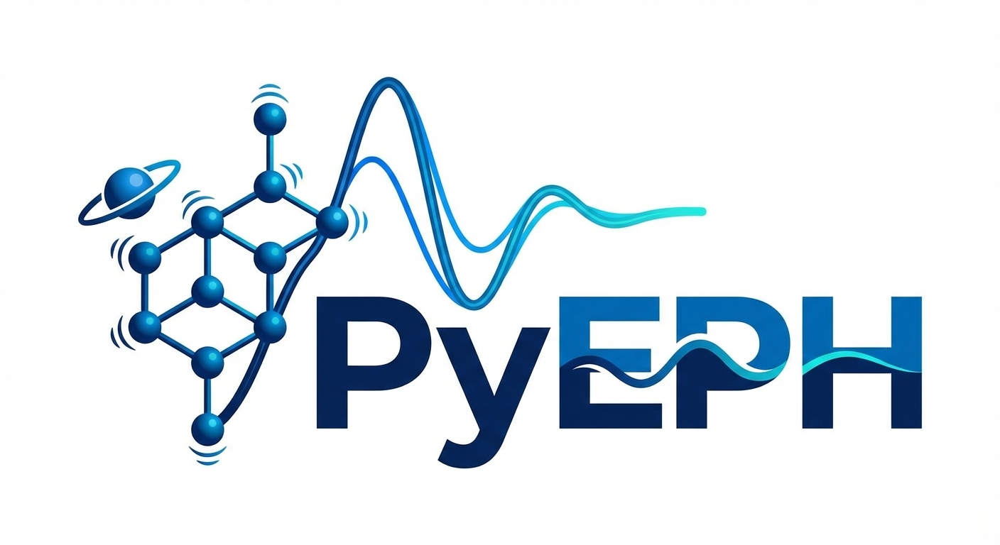

<p align="center">
  
</p>

<!-- <h1 align="center">PyEPH</h1> -->
<p align="center">
  <strong>A Python Package for Electron-Phonon Modeling and Dynamics</strong>
</p>

<p align="center">
  <a href="#installation"></a>
  <a href="#license"></a>
  <a href="#features"></a>
  <a href="#features"></a>
</p>

**PyEPH** is designed for efficient simulation of electron-phonon quantum dynamics for general first-principles Hamiltonians, and simple 1D and 2D lattice models. Current features include:

- **Fully real-space first-principles Hamiltonian** via maximal Wannier localization and interpolation for electronic bands, phonons, and real-space electron-phonon couplings, built on top of [Quantum ESPRESSO](https://www.quantum-espresso.org/), [Wannier90](https://www.wannier.org/), and [PERTURBO](https://perturbo-code.github.io/)
- **Nonperturbative quantum-classical simulation** of real-time dynamics for spectral function, mobility, and optical conductivity. Both 1D and 2D lattice models (Holstein, Peierls, Holstein-Peierls), and general ab initio Hamiltonian (currently tested for organic crystals) is supported.
- **MPI parallelization** and **numba acceleration** for efficient computations.

This package is under active development. Interfaces and features may change significantly as the project evolves.

## Installation

**Requirements:** Python 3.8+

```bash
pip install -r requirements.txt
```

For MPI parallelization:
```bash
pip install mpi4py
```
---

## License

MIT License. See [LICENSE](LICENSE) for details.