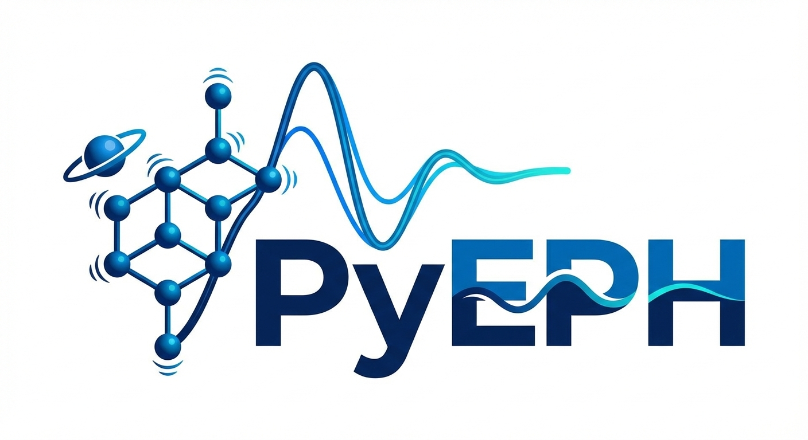
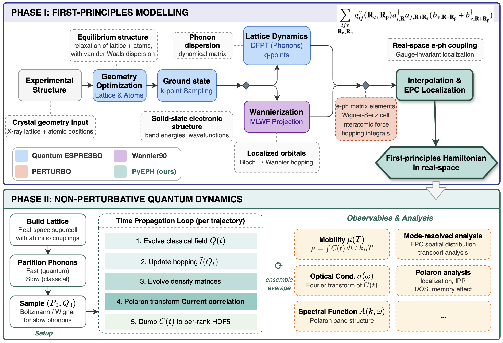

<p align="center">
  
</p>

<h1 align="center">PyEPH</h1>

<p align="center">
  <strong>First-principles electron–phonon Hamiltonians and nonperturbative charge dynamics</strong>
</p>

<p align="center">
  <a href="https://github.com/jiangtong1000/PyEPH/actions/workflows/ci.yml"></a>
  <a href="#installation"></a>
  <a href="#testing"></a>
</p>

PyEPH is a research software package for constructing real-space electron–phonon Hamiltonians and simulating finite-temperature quantum dynamics. It connects first-principles outputs from [Quantum ESPRESSO](https://www.quantum-espresso.org/), [Wannier90](https://www.wannier.org/), and [PERTURBO](https://perturbo-code.github.io/) to nonperturbative quantum-classical calculations of spectral functions, charge mobility, and optical conductivity.

The package supports both model Hamiltonians and general first-principles Hamiltonians, with current ab initio workflows validated primarily for organic molecular crystals.

## Capabilities

- **First-principles Hamiltonians:** interpolate electronic bands, phonons, and electron–phonon couplings in a fully real-space representation based on maximally localized Wannier functions.
- **Model systems:** construct one- and two-dimensional Holstein, Peierls, and Holstein–Peierls models.
- **Quantum dynamics:** simulate nonperturbative real-time dynamics and evaluate Green–Kubo transport observables.
- **Electron–phonon localization:** optimize real-space electron–phonon couplings and analyze molecular or atomic contributions.
- **High-performance execution:** use MPI parallelization, Numba acceleration, sparse matrices, HDF5 output, and JAX-based optimization.
- **DFPT workflow guidance:** document image parallelization, restart, collection, and per-q-point irreducible-representation chunking.

## Scientific workflows

| Workflow | Purpose |
|---|---|
| [First-principles electron–phonon Hamiltonian](examples/01_abinitio_realspace_EPC/) | Quantum ESPRESSO → Wannier90 → PERTURBO → PyEPH |
| [Holstein transport model](examples/02_holstein/) | Run a Green–Kubo charge-transport simulation for a lattice model |
| [Phonon calculations](examples/01_abinitio_realspace_EPC/3_PHONONS/) | Configure DFPT parallelization, restart interrupted calculations, and collect per-q-point results |

Each first-principles workflow stage contains its own README with the required inputs, important numerical parameters, and troubleshooting notes.

<p align="center">
  
</p>

## Installation

PyEPH currently supports **Python 3.10 or newer**. The repository is used directly through `PYTHONPATH` while packaging metadata is being prepared.

```bash
git clone https://github.com/jiangtong1000/PyEPH.git
cd PyEPH

python -m venv .venv
source .venv/bin/activate
python -m pip install --upgrade pip
python -m pip install -r requirements.txt

export PYTHONPATH="$PWD:${PYTHONPATH:-}"
export USE_MPI=false
python -c "import pyeph; print('PyEPH import successful')"
```

For MPI execution, install an MPI implementation on the system and use the MPI dependency set:

```bash
python -m pip install -r requirements-mpi.txt
mpirun --version
export USE_MPI=true
```

The first-principles workflow additionally requires Quantum ESPRESSO, Wannier90, and PERTURBO. Their versions and runtime configuration should be kept consistent across all workflow stages.

The QCPBC-backed localization routine requires `pyqcpbc.OPT` from QCPBC
(QC-PBC), proprietary software from [Q-Chem](https://www.q-chem.com/).
QCPBC is obtained under [Q-Chem's licensing terms](https://www.q-chem.com/purchase/)
and is not distributed with PyEPH. Contact Q-Chem for access to a compatible
installation providing the `pyqcpbc.OPT` interface. The transport and
DNTT EPR extraction demos do not require QCPBC.

## Quick validation

After installation, run the lightweight regression tests:

```bash
python -m pytest -q pyeph/post_qe2pert/test/test_unwrap_epc.py
python -m pytest -q pyeph/greenkubo/tests/test_mp_grid.py
```

## Example: Holstein transport

The included Holstein example runs a Green–Kubo transport calculation and writes trajectory data under `currents_output/`:

```bash
cd examples/02_holstein
USE_MPI=false python run.py 0
```

The command-line argument selects a temperature from the list defined in `run.py`. Production calculations can be launched with the accompanying Slurm template and MPI.

See the [demo instructions](examples/02_holstein/README.md) for expected-output
checks, observed timing and MPI execution. The serial demo generates its own
model inputs and requires no electronic-structure program or separate dataset.

## First-principles workflow

The complete ab initio workflow is documented in [`examples/01_abinitio_realspace_EPC/`](examples/01_abinitio_realspace_EPC/). Its main stages are:

1. structural relaxation and self-consistent DFT;
2. DFPT phonons and optional dispersion-correction Hessians;
3. non-self-consistent DFT and Wannier localization;
4. Quantum ESPRESSO-to-PERTURBO conversion;
5. PyEPH interpolation and electron–phonon localization;
6. real-time dynamics and transport analysis.

The example inputs are templates rather than universal production settings. Convergence thresholds, reciprocal-space grids, pseudopotentials, and parallelization parameters must be validated for each material.

A small DNTT post-processing input (q222, k222; approximately 4.17 MB) is included at
`pyeph/post_qe2pert/test/DNTT_epr.h5`. Follow the
[Step 7 demo](examples/01_abinitio_realspace_EPC/7_PolarEPH/README.md) to extract
real-space EPC data and phonon modes without rerunning DFT or DFPT. This prepares
data for localization; it does not run QCPBC or a complete transport calculation.

A larger [DNTT EPR input (q332, k664; 43.97 MiB)](https://github.com/JoonhoLee-Group/first-principles-transport-data/tree/master/data/epr/DNTT/q332_k664)
is provided in the companion data repository, with dataset parameters and
a runnable extraction example. Its file and cell differ from the bundled
q222/k222 test fixture.

## Repository structure

```text
PyEPH/
├── pyeph/
│   ├── greenkubo/       # Hamiltonians, phonons, propagators, and transport
│   ├── post_qe2pert/    # First-principles interpolation and EPC localization
│   ├── legacy/          # Retained compatibility implementations
│   └── utils/           # Shared numerical and I/O utilities
├── examples/            # Model and first-principles workflows
└── .github/workflows/   # Serial and MPI continuous integration
```

## Testing

The continuous-integration workflow runs serial Green–Kubo tests, first-principles post-processing tests, and a multi-process MPI check. To run the main serial suites locally:

```bash
python -m pytest -q pyeph/greenkubo/tests
python -m pytest -q pyeph/post_qe2pert/test
```

The post-processing suite checks electronic bands, phonon dispersion, EPC
reference values and the DNTT extraction example. Reciprocal-space EPC
calculations use the polar setting stored in the input EPR file.

Serial and MPI tests pass on Linux (Ubuntu 24.04) with Python 3.10.
Tested Python dependency versions are listed in [requirements-tested.txt](requirements-tested.txt).
The MPI tests use Open MPI 4.1.6 and mpi4py 4.1.2.

## Development status

PyEPH is active research software. The version-controlled workflows and regression tests document the behavior used in current studies, while the Python API may continue to evolve. For archival calculations, record the exact Git commit and retain all input files, dependency versions, random seeds, and scheduler settings.

## License

PyEPH is distributed under the [BSD 3-Clause License](LICENSE).
Third-party dependencies retain their own licenses; QCPBC is licensed separately
by Q-Chem and is not distributed with PyEPH.

## Citation

This repository accompanies the following manuscript:

> Tong Jiang and Joonho Lee, “First-Principles Origins of Charge Transport in Molecular Semiconductors” (2026), [arXiv:2607.25089](https://arxiv.org/abs/2607.25089).

First-principles EPR input, processed figure data and plotting notebooks are available in
[first-principles-transport-data](https://github.com/JoonhoLee-Group/first-principles-transport-data).
