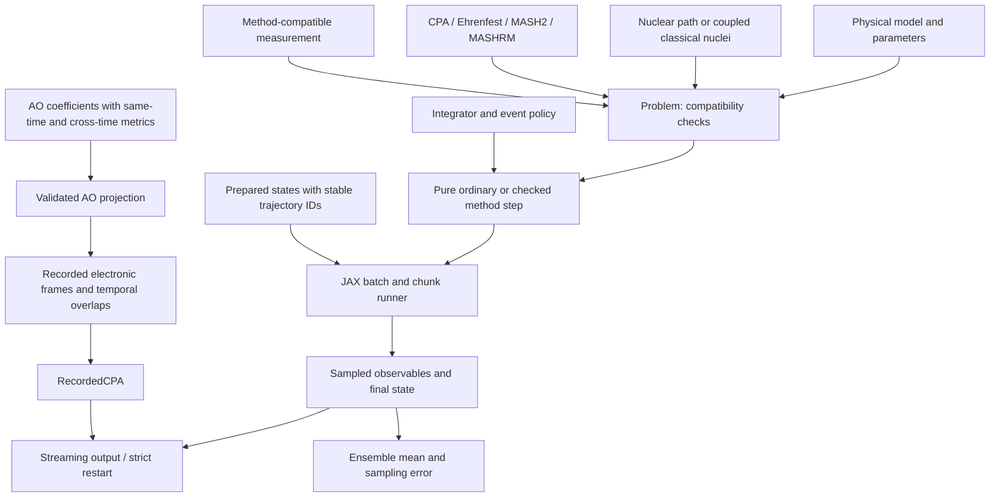

# Implemented architecture

The reusable boundary is a set of physical operations over a declared electronic
space and nuclear coordinates. A Hamiltonian may remain dense, an edge graph, a
periodic orbital-block model, a neural residual, or a composed baseline model.
Only a method's required operations must be supplied. Current/position probes
also belong to the physical model because they depend on its basis and geometry.



`RecordedCPA` is a separate physical profile. A recorded electronic Hamiltonian
or temporal overlap can propagate electronic state along its specified time
grid, but it cannot supply nuclear feedback forces without more information.

The source now has the following responsibilities. Files shown here contain
implementations; this tree is distinct from the broader target plan.

```text
src/pyeph/
├── core/
│   ├── system.py             dimensions, coordinate and basis identity
│   ├── contracts.py          model operations, probes, low-rank weights
│   ├── problem.py            physical assembly and compatibility
│   ├── state.py              explicit trajectory and recorded-path state
│   ├── validation.py         optional host preflight at actual model coordinates
│   ├── coordinates.py        canonical / Cartesian coordinate conversion
│   └── units.py              declared reduced units and ingestion conversion
├── models/
│   ├── base.py               optional autodiff implementation conveniences
│   ├── analytic.py           Tully and classical spin-boson fixtures
│   ├── epc.py                dense and sparse linear electron-phonon models
│   ├── lattice_epc.py        lattice EPC and transport-compatible construction
│   ├── cartesian_epc.py      primitive-cell Cartesian EPC/IFC stencils and image currents
│   ├── fourier_epc.py        optional periodic FFT evaluator with original EPC parameters
│   ├── aggregate.py          nonlinear molecular site/edge model
│   ├── periodic.py           cell-image orbital blocks and physical currents
│   ├── neighbors.py          candidate construction, periodic images and coverage
│   ├── local.py              atomic center maps and replaceable block coefficients
│   ├── fragment.py           oriented effective fragment orbitals and atomic derivatives
│   ├── slater_koster.py      Cartesian s,p blocks and explicit optional atomic SOC
│   ├── _block.py             shared sparse Hermitian block action
│   ├── composite.py          additive models and compensated reference shifts
│   ├── neural.py             native differentiable residual example
│   └── polaron.py            explicit Hamiltonian dressing
├── adapters/
│   ├── real_space_epc.py     format-independent Cartesian stencils and unit conversion
│   ├── epr.py                explicit PERTURBO source conventions and provenance
│   ├── torch.py              dense provider-owned derivatives through host callbacks
│   ├── torch_reference.py    scalar reference energy/forces beside a native carrier
│   ├── torch_local.py        sparse Torch block heads and complete atomic forces
│   └── ao_frames.py          validated moving-AO projection into recorded CPA
├── paths/
│   ├── harmonic.py           prescribed harmonic paths and independent baths
│   ├── normal_modes.py       coupled finite-system Cartesian harmonic motion
│   ├── periodic_harmonic.py  primitive-cell modes, FFT motion and thermal sampling
│   ├── nuclear.py            recorded positions/velocities and interpolation
│   └── electronic.py         fixed-basis frames or adiabatic temporal overlaps
├── representations/
│   ├── adiabatic.py          spectra, selected forces/couplings, validity
│   ├── mapping_rm.py         all-state rank-two RM impulse contraction
│   ├── gauge.py              column phase alignment and fixed basis transforms
│   └── connection.py         raw overlap versus declared transport maps
├── dynamics/
│   ├── cpa.py                prescribed-nuclei electronic dynamics
│   ├── ehrenfest.py          coupled mean-field dynamics
│   ├── checked.py            action budgets and whole-batch acceptance gates
│   ├── mash2.py              real two-state mapping dynamics and estimator
│   ├── mashrm.py             public RM preparation, validation and measurement
│   ├── _mashrm_step.py       private RM smooth steps and isolated-pair event controller
│   ├── mashrm_mapping.py     conditional-sphere RM preparation and estimators
│   └── recorded.py           electronic-only recorded-path propagation
├── integrators/
│   ├── electronic.py         RK4 and exponential electronic substeps
│   ├── krylov.py             checked matrix-free Hermitian exponential action
│   ├── events.py             bounded scalar crossing localization
│   └── impulses.py           canonical mass-weighted rescale/reflection
├── observables/
│   ├── population.py         amplitude populations and measurement extension
│   ├── statistics.py         independent-sample mergeable moments
│   └── transport/            CPA correlations, full/compact LF contractions and RM velocities
├── workflows/
│   ├── transport.py          thermal preparation + propagation + measurement
│   ├── column_transport.py   action-only CPA correlations from density factors
│   ├── polaron_transport.py  reduced quantum bath and transformed estimator
│   ├── canonical_metropolis.py explicit finite-chain nonlinear preparation
│   ├── mashrm_equilibrium.py joint canonical preparation for confined linear EPC
│   └── mashrm_transport.py   single-origin RM correlations and continuation
├── execution/
│   ├── campaign.py           persistent work-unit claims, recovery and result shards
│   ├── differentiable.py     pure smooth rollouts with separate host preflight
│   ├── runner.py             public execution policy, block cache and output publication
│   ├── _blocks.py            compiled ordinary/checked scans and observation buffers
│   ├── _validation.py        host trajectory preflight for execution and checkpoints
│   ├── random.py             identity-based random streams
│   └── ensemble.py           batch initialization and partition statistics
├── learning/
│   ├── labels.py             data conventions and structural holdout splits
│   ├── reports.py            validation errors with units and split identity
│   ├── bundles.py            parameter artifacts, identity and revalidation
│   └── domain.py             sampled geometry diagnostics and failure records
├── io/
│   ├── checkpoint.py         atomic state and optional workflow-context checksums
│   ├── provenance.py         model/config/data/source identity
│   └── hdf5.py               sampled observable streaming
├── preprocessing/qe/        host-only DFPT staging, audit and collection tools
├── post_qe2pert/             native maintained EPR preprocessing migration
├── greenkubo/                maintained legacy workflow/API facade
├── initialization.py         classical/Wigner canonical harmonic ensembles
├── thermal.py                opt-in action-based electronic density-factor preparation
└── simulation.py             thin public orchestration entry point
```

## Reading a calculation

Start with the small calculation in the README. `Problem` holds the model,
parameters, nuclear treatment, method and measurement. `Simulation` exposes the
runner's public API; the runner validates the state, executes compiled chunks,
then publishes observations. To read the equations, go directly to the chosen
method's `build_step`, not the execution machinery.

The runner's private `_validation` module handles host checks; `_blocks` builds
the JAX scans and optional output buffers. Both ordinary and checked blocks take
numerical parameters as runtime arguments. They have distinct control flow:
checked propagation must cancel subsequent stages after a failed action.
Checkpoint and output policy remain in the runner; the helpers introduce no new
public configuration or state format.

The initial measurement uses its own cached array kernel when JIT is enabled.
Parameters and trajectory state remain runtime arguments. Host preflight,
origin checks, failure handling and output publication still surround that
kernel; no observation values or scientific identities are cached.

MASHRM delegates its numerical step to `_mashrm_step`. Read `smooth` for the
surface equations, `inspect_impulse`/`apply_event` for the momentum change, and
`locate`/`advance_interval` for event control. Its private immutable context is
created by each step builder with the current parameters. It stores no evolving
trajectory or persistent spectrum cache. Original MASH2 keeps its own numerical
implementation and estimator.

Ordinary Ehrenfest keeps its short physical splitting explicit. The checked
variant shares the complete mean-field force and the gated half-kick logic,
while retaining the extra force/action failure checks and whole-step rollback.

CPA and Ehrenfest remain separate methods sharing electronic numerical kernels.
CPA needs a prescribed path and Hamiltonian action and can propagate a vector,
full evolution matrix or column block. Ehrenfest needs complete forces and a
compatible electronic state for nuclear feedback. Class inheritance would not
remove work from the compiled loop and would obscure those different contracts.

The [Cartesian EPC bridge](AB_INITIO_EPC.md) turns source stencils into the same
model operations. Its EPR-specific reader is separate from the file-independent
data boundary and runtime kernels. Electronic image channels remain distinct
after finite-cell wrapping so physical currents retain their displacements.
Its optional [Fourier EPC evaluator](FOURIER_EPC.md) changes the contraction
over periodic displacement cells while keeping the same source parameters,
force/probe operations and dynamics methods. It has an explicit coefficient
symbol allocation limit; direct term batching remains the default.
The [harmonic baths](HARMONIC_BATHS.md) independently choose dense finite modes
or primitive-cell Fourier modes; neither changes the Hamiltonian interface.

[Thermal column preparation](THERMAL_COLUMNS.md) is a separate initialization
operation. A fixed spectral plan and Hamiltonian action produce a normalized
density factor for the existing column workflow. It adds no dynamics inheritance,
model hook or checkpoint payload. Its finite-rank sampling error is separate
from polynomial error and subsequent propagation error.

The [compact LF estimator](COMPACT_LF.md) changes the contraction on a declared
current-edge support. It retains the full electronic propagator and existing
transport payload; explicit arbitrary quadruple subsets retain their full-sector
API. This keeps numerical optimizations local to the operation they accelerate.

The host-only [DFPT tools](DFPT_CHUNKS.md) prepare and inspect external QE
calculation files. They sit beside EPR preprocessing and introduce no dependency
from the dynamics kernels to a scheduler, filesystem workflow or QE executable.

## Extension rules

1. A new model supplies `spec` and `apply(params,q,vectors)`, plus the operations
   its method and measurements require. Total-energy evaluation needs
   `reference_energy(params,q)`; coupled forces need the complete reference
   gradient and contracted electronic gradient. The standard `GeometryModel`
   and `ForceModel` protocols describe full energy/force providers. Inheriting
   `AutoDiffModel` is convenient for a native JAX model, not mandatory.
   Optional `prepare_action(params,q)` prepares a pure operator action for one
   geometry. Checked electronic propagation and each ordinary Ehrenfest
   electronic half-step can then reuse dense, sparse or block coefficients
   across their inner iterations. It adds no persistent cache
   and does not change the required `apply` operation or force contract.
   Optional `diagonal(params,q)` returns the diagonal of that same Hamiltonian.
   The LF wrapper can then narrow its off-diagonal action without constructing
   a full matrix. A provider overriding the Hamiltonian must also keep its
   diagonal consistent; unsupported overrides use the dense reference fallback.
   Optional `validate_at(params,q,*,batch=False)` checks the provider at supplied
   initial geometries before output or checkpoint acceptance; otherwise the
   existing geometry-only check is used. This does not certify later states.
2. A new method owns its equations, preparation/trajectory state and scientific
   estimator. It validates a `Problem` and produces a pure `build_step` function.
   Optional integrator validation, state/result validation, model-aware initial
   validation and `step_succeeded`
   hooks handle methods with bounded event failures.
   The optional `build_checked_step(..., batch=...)` hook owns scalar gates
   between vectorized stages and returns transient solver diagnostics separately
   from physical method state. CPA/Ehrenfest use it for checked Lanczos actions.
3. The runner owns batching and output scheduling. Numerical parameters are
   runtime PyTrees; model topology and method options are explicit configuration.
   Changing a physical model is separate from changing batch/output policy.
4. A model probe defines a physical operator. A measurement specifies how that
   operator enters a population, expectation or correlation estimator. MASH
   mapping amplitudes cannot be passed to a generic amplitude-population
   estimator and interpreted as physical populations. Optional host-side
   `validate_observations` rejects invalid saved blocks before publication.
   A measurement's optional `validate_initial_state` checks workflow origins
   at run/checkpoint boundaries even when output is disabled.
5. A specialized workflow assembles these components and its extra physics.
   For example, an LF transport estimator includes quantum-bath sector weights;
   those cannot be recovered merely by narrowing the hopping matrix. Canonical
   RM preparation includes the electronic partition-function weight. Its
   correlation workflow preserves per-trajectory initial velocities outside
   method state and forms products before independent-trajectory reduction.
   Column CPA transport instead propagates an explicit density factor and its
   current insertions, retaining the linear trace estimator with sparse model
   actions. Its beta-zero trace preparation is distinct from thermal filtering.
6. A prescribed nuclear treatment supplies `validate(q_shape)` and
   `point(state,elapsed)`. An optional `validate_initial_state(state,*,batch)`
   performs host checks before runs and checkpoint acceptance; constrained
   harmonic baths use it to reject nonzero momentum in frozen modes. Its
   arrays and physical policies are immutable configuration, not hidden
   trajectory caches.

This design does not require a universal sum-of-products representation. Such
a constructor can later implement the same model operations when it suits a
problem. Dense diagonalization and a full Hamiltonian derivative tensor are
not mandatory for CPA or Ehrenfest. MASHRM explicitly requests a small complete
isolated spectrum through these operations. Complex CPA/Ehrenfest support does
not declare complex/SOC MASH capability.

The phase helpers do not implement general state ordering or tracking through
degenerate subspaces. Temporal overlap diagnostics and transport maps likewise
do not supply the missing force terms of a moving nonorthogonal orbital basis.
The [AO ingestion bridge](AO_RECORDED_PATHS.md) preserves this separation: it
validates metric orthonormality and physical cross-time contractions, then
returns a recorded path with bound source evidence. It supplies neither
spatial basis derivatives nor a force-capable Hamiltonian constructor.

The optional [Torch local adapter](TORCH_LOCAL_MODELS.md) shares the native
block graph and physical operations while keeping geometry and complete
coefficient derivatives inside Torch. Only local values cross into JAX sparse
actions; the framework boundary does not require a dense Hamiltonian or a
generic backend abstraction for every method.

See [model extension](ADDING_MODELS.md), [method extension](ADDING_METHODS.md),
[MASH2](MASH2.md), [MASHRM](MASHRM.md), [RM transport](RM_TRANSPORT.md),
[ensembles](ENSEMBLES.md), and the [qualification scope](QUALIFICATION.md)
for executable examples and the remaining validation work.
