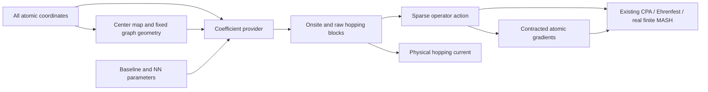

# Local coefficients from atomic geometry

`LocalBlockModel` is one concrete representation family for finite site models
and periodic image-edge models. It keeps a sparse graph and small uniform
orbital blocks while a replaceable native JAX function supplies their values.
The dynamics still consumes the existing operator/gradient operations; there
is no new universal Hamiltonian format.

For an existing Torch feature extractor or local Hamiltonian head, use
[`TorchLocalBlockModel`](TORCH_LOCAL_MODELS.md), which preserves these geometry
and block conventions with explicit CPU callbacks and Torch-owned gradients.



The intended first applications are fragment charge states in aggregates and
fixed effective orbital blocks in a disordered periodic supercell. This
infrastructure is not a trained molecular or perovskite model. A scalar radial
NN example cannot establish orbital or spin equivariance, molecular orientation
sensitivity, electrostatic screening or long-range polar EPC.

## Data and provider boundary

The family has four small public data/model types in `pyeph.models.local`:

| Type | Responsibility |
|---|---|
| `LocalBlockGraph` | Site count, uniform block size, unique edges, optional row-vector cell, and optional smooth cutoff. |
| `AtomCenterMap` | Fixed sparse assignment/weights from all atomic coordinates to electronic centers. |
| `LocalCoefficients` | Onsite `(site, orbital, orbital)` and raw hopping `(edge, orbital, orbital)` arrays. |
| `LocalBlockModel` | Existing native action/force operations, coefficient preflight and hopping probes. |

The numerical interface is

```python
coefficient_provider(params, q_atoms, geometry) -> LocalCoefficients
```

All weights and numerical baseline parameters belong in the runtime parameter
PyTree. The provider may be a function or a callable object. It receives the
complete atomic array, so the number of nuclear coordinates need not equal the
number of electronic sites or orbitals. For example, six atoms can describe
three fragment centers and three carrier states, or four atoms can describe
two centers with two retained channels each.

The sparse center map defines `R_i = sum_A w_A q_A` for atoms assigned to i.
The static weights sum to one for each center. They define the chosen position
centers, not necessarily the participation of atoms in a learned descriptor.
A zero-weight atom can still influence the provider through `q_atoms`.
Parameter- or geometry-dependent center definitions need a separately designed
map; the static map does not infer them.

The graph defines a Hermitian pair once. For a periodic edge `(i,j,nx,ny,nz)`,

\[
d_{ijn}=R_j+n\,\mathrm{cell}-R_i.
\]

The reverse contribution is the conjugate transpose. Nonzero self-image edges
are supported; their reverse is generated too. Onsite blocks must already be
Hermitian. The provider is not silently symmetrized or projected to real values.
Complex nonsymmetric hopping blocks are legitimate. Declaring a real provider
means its coefficients must actually remain real.

The first interface is the real-space simulation supercell at Gamma. A
primitive-cell Bloch representation would require explicit lattice-gauge phase
and rewrapping checks; it is not inferred from the physical Peierls probe.

## Baseline, residual and reference energy

Combine a physical carrier baseline and a learned residual at the coefficient
level, before the operator and its current are assembled:

```python
def complete_coefficients(params, q_atoms, geometry):
    base = baseline(params["baseline"], q_atoms, geometry)
    correction = residual(params["nn"], q_atoms, geometry)
    return LocalCoefficients(base.onsite + correction.onsite,
                             base.hopping + correction.hopping)
```

`LocalBlockModel` supplies a zero scalar nuclear reference. A neutral nuclear
potential is a separate model with the **same atomic coordinate shape and
electronic basis identity**, combined using `SumModel`. Center-coordinate
analytic fixtures cannot be added directly to an all-atom model merely because
their electronic dimensions match. Define the reference on the actual atomic
coordinates and differentiate every contribution there.

When probes are additive, declare them explicitly with `SumModel.additive_probes`.
A reference-only model contributes zero electronic hopping current. A full
laboratory-frame convection term must not be duplicated across a baseline and
residual. The existing dense `NeuralResidualModel` remains useful for small
general matrix examples; it does not inherit a sparse baseline's current.

`contract_gradient` differentiates a scalar contracted action through the
provider, atomic features, center map and cutoff. It avoids a full electronic
matrix derivative tensor. `prepare_action` evaluates geometry/coefficient work
once inside an electronic action, preserving dynamic parameters and their
gradients. Preparation is local to the numerical function, not a persistent
cache.

## Cutoff and graph ownership

The adapter applies the graph's smooth support to the returned **raw hopping**
exactly once. A baseline or residual provider must not apply that final envelope
again. If no cutoff is requested, support is one.

Neighbor messages that affect onsite or other-edge coefficients are the
provider's responsibility. Multiply those messages by the appropriate support
inside the differentiable graph; a final hopping cutoff alone does not remove
a distant atom's influence on an onsite prediction. A scalar local example can
demonstrate this convention, but arbitrary provider code can ignore it or use
all coordinates globally. The adapter cannot certify locality or smoothness of
an arbitrary callback.

The fixed candidate graph also defines which interactions exist. It does not
detect an omitted pair approaching during motion, rebuild neighbor lists or
guarantee cutoff coverage. Use a conservative graph for the intended coordinate
domain. Hard distance or magnitude pruning is not a substitute for a smooth
model; later neighbor-list rebuilding needs its own continuity/capacity contract.

## What the current means

Every channel on site i uses the same point position `R_i I`. The supplied
`current_x/y/z` is the hopping **charge current** obtained from the derivative
of the uniformly Peierls-phased operator:

\[
T_e(\kappa)=T_e\exp(i\kappa\cdot d_e),\qquad
J_\alpha=q_{\rm charge}\,\partial_{\kappa_\alpha}h(\kappa)|_0.
\]

This includes learned and baseline hopping coefficients. It contains no ionic
current, internal onsite dipole matrix or center-convection contribution. The
time derivative of a moving point-center position operator would additionally
contain its explicit velocity term. A charge-current name is not a unit or
charge conversion to an RM velocity observable.

For a periodic self-image block, `H = T+T†` and
`J_alpha = i*charge*d_alpha*(T-T†)`. This current can be nonzero even though the
two indices refer to the same site in the simulation cell. A commutator with
wrapped diagonal site positions would lose it. A real symmetric hopping test
would give zero and would not validate this case; independent tests need a
nonsymmetric or complex block.

Coherent fragment rewrapping shifts all atoms assigned to a center by the same
integer cell vector and updates edge images by `n'=n+s_i-s_j`. The provider
and center map remain attached to the returned model. Independently wrapping
atoms within a molecular fragment is a different unwrapping problem and is not
handled by this operation.

## Validation and scope

The model checks static shapes/dtypes during coefficient evaluation and offers
the optional `validate_at(params,q,*,batch=False)` host preflight. Runner invokes
it on all supplied initial geometries before output and checkpoint acceptance.
It checks mapped geometry and the actual returned coefficients for finite
values, declared reality and onsite Hermiticity. Batch coefficient evaluation
uses native vectorization.

These checks concern the supplied geometries. During propagation an arbitrary
provider remains responsible for its pure, smooth, finite and Hermitian
contract. Initial preflight does not prove that contract at later geometries,
and a finite-state check does not generally detect a finite non-Hermitian
operator. Representative distortion, derivative and symmetry tests remain
part of developing each physical provider.

Opaque/custom providers require explicit artifact identities for strict
checkpoint provenance, covering code, captured data and external model weights.
Ordinary numerical weights should remain in the parameter tree. A source hash
alone cannot identify mutable captured behavior.

Complex fixed-basis providers can use the existing CPA/Ehrenfest paths.
Current real finite-state MASH support still requires a real Hamiltonian and
complete isolated spectrum; a new coefficient representation does not expand
that method's physics. Large-band MASH, changing electronic spaces, moving AO
bases and orbital/spin equivariance remain separate developments.

## Runnable baseline-plus-NN example

```sh
PYTHONPATH=src .venv/bin/python examples/local_learned_coefficients.py \
  --output-dir .cache/local-demo
```

The command refuses existing result files. The source keeps the scalar head in
the example so a particular NN architecture is not part of the dynamics API.
Its random weights illustrate differentiable inference, not a training result.
Both fixtures use all atomic coordinates, a separate nonzero harmonic nuclear
reference and the same public Ehrenfest runner with sparse RK4 actions.

Run the example to generate a new report with source hashes, raw trajectories,
force and current finite differences, and timestep/refinement comparisons.
The tests additionally cover nonsymmetric complex blocks, complete parameter
and coordinate derivatives, periodic image currents and strict provenance.
These establish the effective model contracts, not fitted material accuracy.
