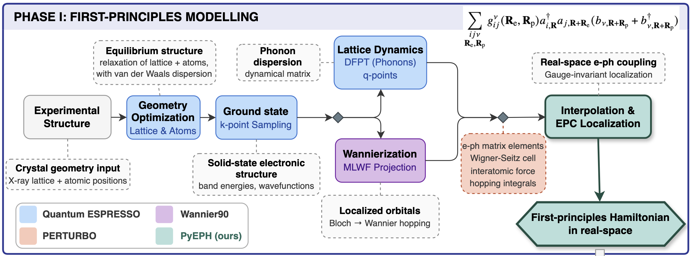

# Workflow: Build First-Principles EPH Hamiltonian

Construct an real-space first-principles EPH Hamiltonian from crystal structure.

**Software stack:** Quantum ESPRESSO 7.3, Wannier90, Perturbo, PyEPH

## Workflow Overview

| Step | Dir | Program | Purpose |
|------|-----|---------|---------|
| 0 | `0_VcRelax/` | `pw.x` | lattice + atomic relaxation (optional if already relaxed) |
| 1 | `1_SCF/` | `pw.x` | SCF with relaxed geometry on coarse k-grid |
| 2 | `2_D3HESS/` | `d3hess.x` | D3 dispersion Hessian (only if `vdw_corr = grimme-d3`) |
| 3 | `3_PHONONS/` | `ph.x` | DFPT phonon calculation on coarse q-grid |
| 4 | `4_NSCF/` | `pw.x` | NSCF on finer k-grid (for Wannierization) |
| 5 | `5_WANN/` | `wannier90.x` / `pw2wannier90.x` | Wannier90 localization |
| 6 | `6_QE2PERT/` | `qe2pert.x` | Process data, output `epr.h5` |
| 7 | `7_PyEPH/` | PyEPH | Localization of EPC and build real-space EPC Hamiltonian |

Each step directory has its own `README.md` with detailed notes, key parameters, and troubleshooting tips.