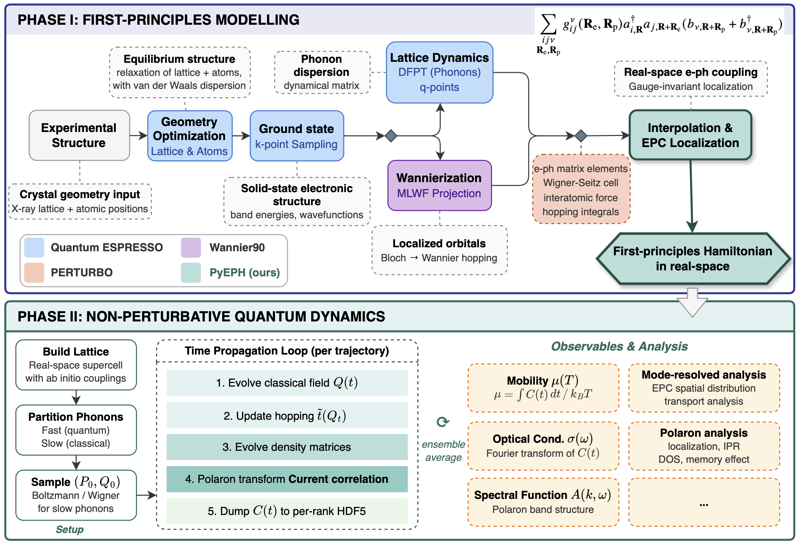

# PyEPH Workflows

Workflows for electron-phonon coupling modeling and dynamics simulation.

## Available Examples

| # | Example | Description |
|---|----------|-------------|
| 01 | [Build Hamiltonian](01_abinitio_realspace_EPC/) | Full QE → Perturbo → PyEPH workflow to construct the first-principles e-ph Hamiltonian in Wannier basis |
| 02 | Dynamics Simulation | *(to be added)* |